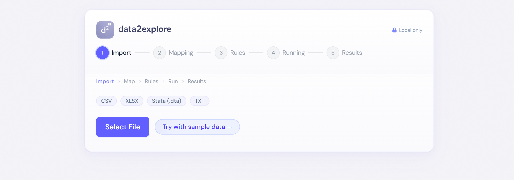
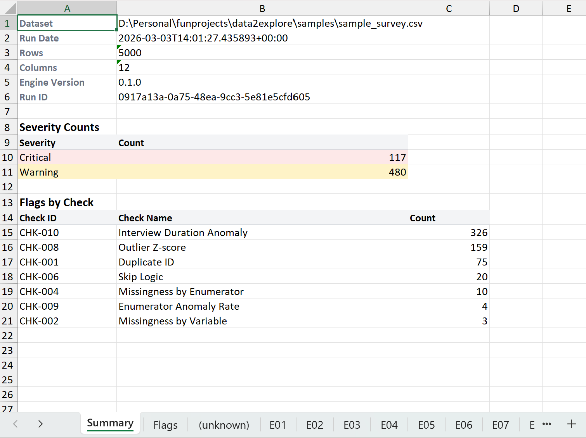
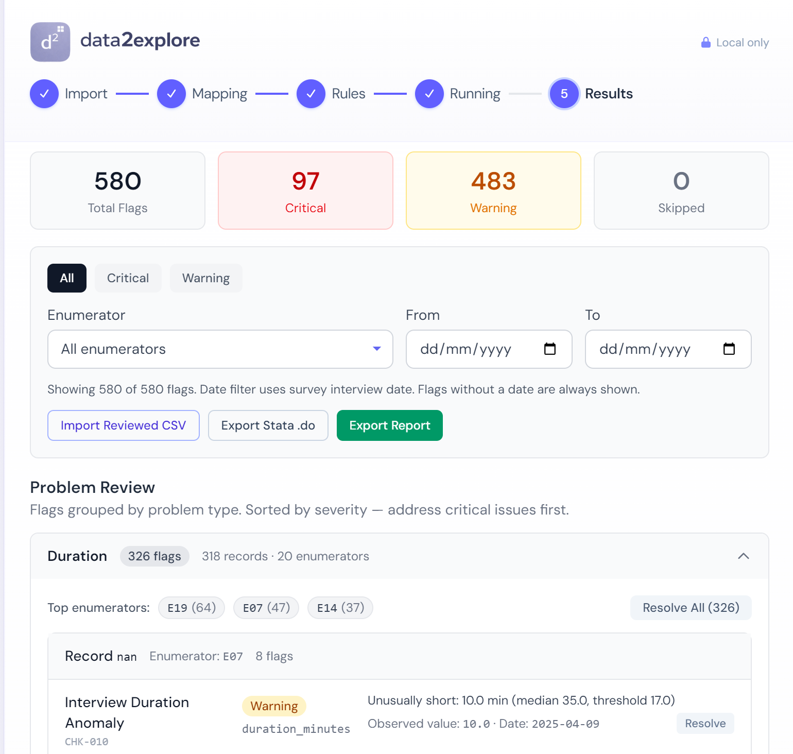
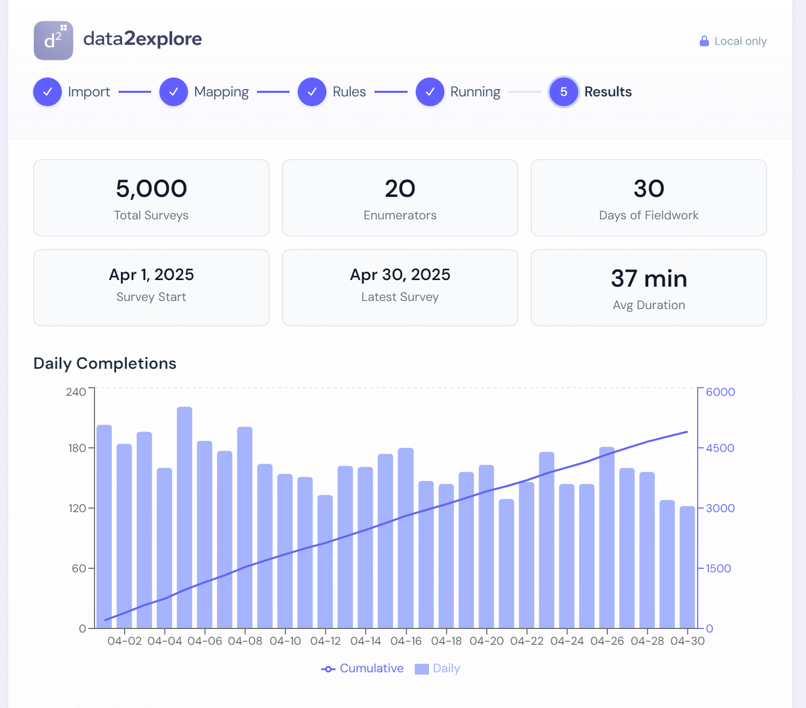
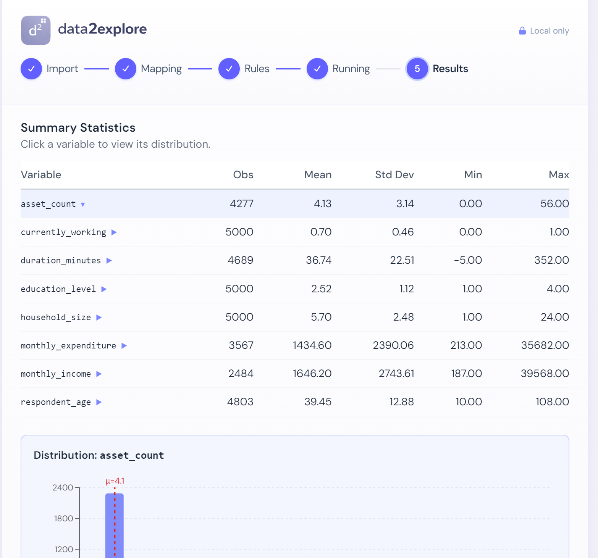

<p align="center">
  
</p>

<p align="center">
  <strong>Catch survey data problems before they become research problems.</strong>
</p>

<p align="center">
  
  <a href="LICENSE"></a>
  
  
</p>

---

**data2explore** is a desktop app for running **high-frequency checks (HFC)** on survey data. It helps field supervisors and research teams detect data quality issues, such as duplicates, outliers, missing data patterns, enumerator anomalies, early in fieldwork, before everything gets messier.

Everything runs locally. No raw data leaves your machine.

<p align="center">
  
</p>

## 🎯 Why

Survey fieldwork generates thousands of records across dozens of enumerators, and the more complex the instrument, the more room for error. Without daily monitoring, problems like duplicate IDs, systematic missing data, or fabricated interviews go unnoticed until the analysis phase — weeks or months later, when re-interviews are no longer possible. Quality data is the foundation of credible research; catching issues early protects both.

High-frequency checks (HFCs) solve this by flagging anomalies daily so supervisors can verify and correct them in the field. But setting up an HFC pipeline is costly: it typically requires a Stata license, custom do-files, and programming expertise. Tools like SurveyCTO's built-in checks and IPA's `ipacheck` help, but still demand technical setup or lack the flexibility that complex surveys need — so many teams end up writing bespoke scripts anyway.

data2explore removes these barriers. Import your data, map your variables, choose your checks, and get results — no coding, no Stata license. It's designed so that anyone on the team, not just the RA who knows Stata, can run quality checks and act on the findings. Less time maintaining pipelines, more time managing fieldwork.

## ✨ Features

### 🔍 9 automated checks

| Check | What it catches | Severity |
|-------|----------------|----------|
| **Duplicate ID** | Same respondent ID appears more than once | Critical |
| **Missingness by Variable** | Columns with abnormally high missing rates | Warning / Critical |
| **Missingness by Enumerator** | Enumerators with unusual per-column missing patterns | Warning |
| **Range** | Values outside user-defined min/max bounds | Critical |
| **Skip Logic** | Fields with data that should be empty given prior answers | Critical |
| **Outlier (Z-score)** | Statistical outliers in numeric columns | Warning |
| **Enumerator Anomaly Rate** | Enumerators with disproportionately high flag counts | Warning |
| **Duration Anomaly** | Interviews that are impossibly short, suspiciously long, or heaped at round numbers | Warning / Critical |
| **Allowed Values** | Column values outside a defined set of valid options | Critical |

### 🔄 Workflow

```
Import  -->  Map Columns  -->  Configure Rules  -->  Run  -->  Results
 CSV          id                thresholds           9         flags table
 XLSX         enumerator_id     range rules         checks     performance dashboard
 Stata .dta   survey_date       skip logic                     distributions
 TXT          duration          allowed values                 enumerator analytics
```

### 📊 Exports and reporting

- **Excel workbook** with per-enumerator review sheets, summary, and editable Status/Note columns
- **CSV export** for external processing
- **Stata .do file** that replicates all checks in Stata 14+ syntax for independent verification

<p align="center">
  
</p>

### 📈 Survey performance dashboard

- Daily completion trends
- Interview duration distributions
- Per-enumerator productivity metrics with flag counts

### 🔁 Delta tracking

Run checks daily on updated data. data2explore compares consecutive runs and shows which flags are **new**, **resolved**, or **persisting**, so the team can focus on what changed.

### 🔒 Privacy-first

All processing happens locally via an embedded Python engine. No cloud services, no data upload, no telemetry. Your survey data stays on your machine.

## 📥 Download

> **Windows only** for now.

Download the latest installer from [**GitHub Releases**](https://github.com/thoriqakbar/data2explore/releases).

Run the `.exe` installer. Windows SmartScreen may show an "unknown publisher" warning (the app is not code-signed yet) — click **More info** then **Run anyway**.

### 📂 Supported data formats

| Format | Extension | Notes |
|--------|-----------|-------|
| CSV | `.csv` | Comma-separated |
| Excel | `.xlsx` | Reads first non-empty sheet |
| Stata | `.dta` | Stata 14+ binary format |
| Text | `.txt` | Auto-detects comma, tab, or pipe delimiter |

## 🚀 Quick start

1. **Launch** data2explore
2. **Import** your survey data file (or click "Try with sample data" to explore)
3. **Map** your variable — the app auto-detects common field names like `respondent_id`, `interviewer_id`, `interview_date`
4. **Configure** which checks to run and set thresholds (defaults work well for most surveys)
5. **Run** — results appear in three tabs:
   - **Data Quality** — flags grouped by issue type, with delta tracking
   - **Survey Performance** — daily trends, duration charts, enumerator metrics
   - **Summary & Distributions** — variable profiles, histograms, percentiles

Your configuration is auto-saved next to your data file, so daily re-runs only need one click.

<p align="center">
  
  
</p>
<p align="center">
  
</p>

---

## 🏗️ Building from source

### ⚙️ Prerequisites

- [Node.js](https://nodejs.org/) 18+ with [pnpm](https://pnpm.io/) 10+
- [Python](https://www.python.org/) 3.11+ with [uv](https://docs.astral.sh/uv/)

### 🛠️ Setup

```bash
# Clone the repository
git clone https://github.com/thoriqakbar/data2explore.git
cd data2explore

# Install JS dependencies
pnpm install

# Install Python dependencies
cd engine && uv sync && cd ..

# Start development
pnpm dev
```

### 📦 Build the installer

```bash
# Full pipeline: freeze Python engine + build app + create NSIS installer
pnpm package

# Output: release/data2explore Setup X.X.X.exe
```

### 🧪 Run tests

```bash
# Python engine tests (237 tests, 92-100% coverage)
cd engine && uv run pytest --cov

# TypeScript type checking
pnpm typecheck
```

## 🏛️ Architecture

```
Renderer (React/Vite)  --IPC-->  Main (Electron/Node)  --subprocess-->  Python engine
   app/src/                        app/electron/                          engine/d2e_engine/
```

The app is a two-process Electron application. The React renderer communicates with the Electron main process via IPC. The main process spawns the Python engine as a child process for each command (profile, summarize, check, performance, report). In production, the Python engine is frozen into a standalone executable via PyInstaller and bundled inside the app installer.

| Layer | Tech |
|-------|------|
| UI | React 18, TypeScript 5.7, Tailwind CSS v4, Recharts |
| Desktop shell | Electron 34 |
| Engine | Python 3.11, pandas, openpyxl, pyreadstat |
| Packaging | PyInstaller (engine freeze), electron-builder (installer) |
| Testing | pytest (237 tests), TypeScript strict mode |

## 📁 Project structure

```
data2explore/
  app/                    # Electron + React frontend
    electron/             #   Main process (IPC, engine spawning)
    src/                  #   React renderer (UI components)
    public/               #   Static assets (icons, images)
  engine/                 # Python HFC engine
    d2e_engine/           #   Core modules (checks, profiling, export)
      checks/             #   Individual check implementations
    tests/                #   pytest test suite (237 tests)
  shared/                 # Shared TypeScript types and JSON schemas
  samples/                # Sample data for testing and demos
  docs/                   # Product specs and documentation
```

## 🤝 Contributing

Contributions are welcome. If you find a bug or have a feature idea, please [open an issue](https://github.com/thoriqakbar/data2explore/issues).

For code contributions:

1. Fork the repository
2. Create a feature branch (`git checkout -b feature/your-feature`)
3. Make your changes and add tests
4. Run `pnpm typecheck` and `cd engine && uv run pytest` to verify
5. Submit a pull request

## 📄 License

[MIT](LICENSE) - Mochamad Thoriq Akbar
